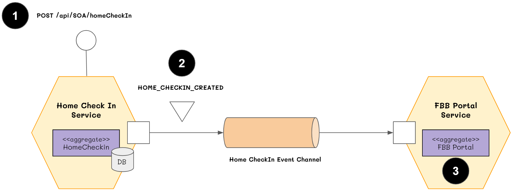

# NodeJS Choreography-based saga pettern

## Archiecture

An support technicial application that uses this approach would create case using a choreography-based saga that consists of the following steps:

1. The SOA HomeCheckInService receives the POST /case and creates a HomeCheckIn in a PENDING state..
2. It then emits an Home CheckIn Created event
3. The FBB Portal Service’s event handler attempts to save check in status and logging.

## APPs
- SOA HomeCheckInService (Producer)
- FBB Portal Service (Consumer)

## Stacks
- MongoDB
- Kafka (Message Queue System)

